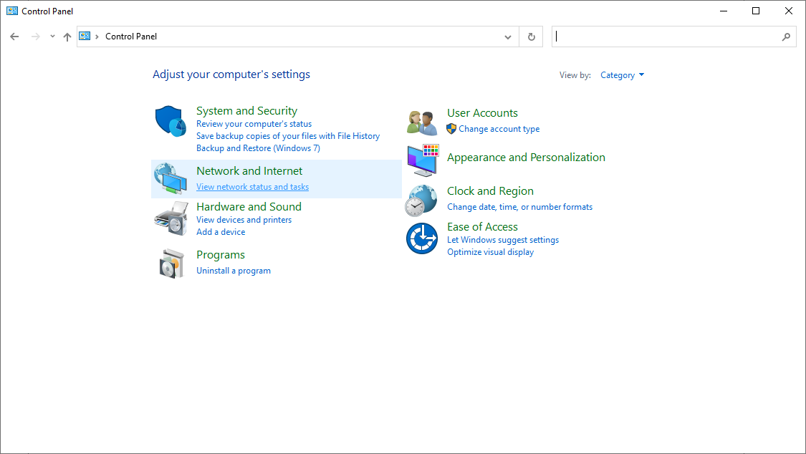

# Changing-DNS-Settings
Instructions on changing DNS Settings in Windows

# Changing DNS Settings to use LANCache

## Step 1: Open Control Panel

Navigate to `View network status and tasks`

## Step 2: Navigate to Ethernet Connection

Click `Properties` in the window that opens

## Step 3: Uncheck `Internet Protocol Version 6(TCP/IPv6)`

## Step 4: Double click `Internet Protocol Version 4(TCP/IPv4)`

## Step 5: Change DNS Setting to Point to 10.0.0.10

Next restart your PC.

---

# Changing DNS Settings to use LANCache

## Step 1: Open Control Panel

Navigate to `View network status and tasks`

## Step 2: Navigate to Ethernet Connection

Click `Properties` in the window that opens

## Step 3: Re-Check `Internet Protocol Version 6(TCP/IPv6)`

## Step 4: Double click `Internet Protocol Version 4(TCP/IPv4)`

## Step 5: Change DNS Setting to Automatic

Next restart your PC.
